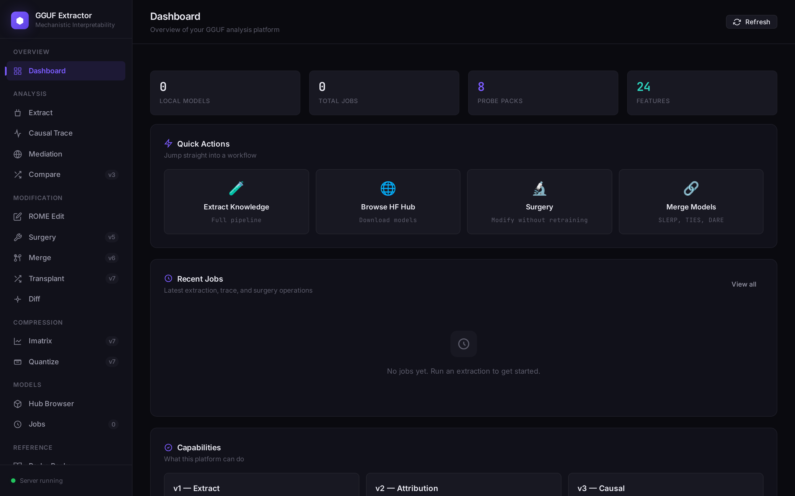
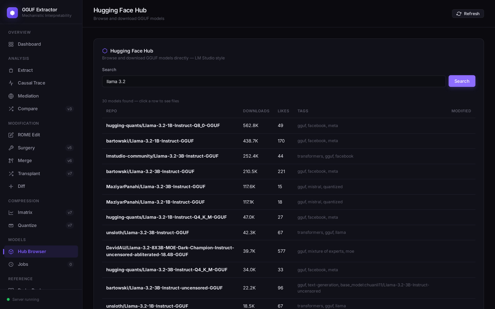
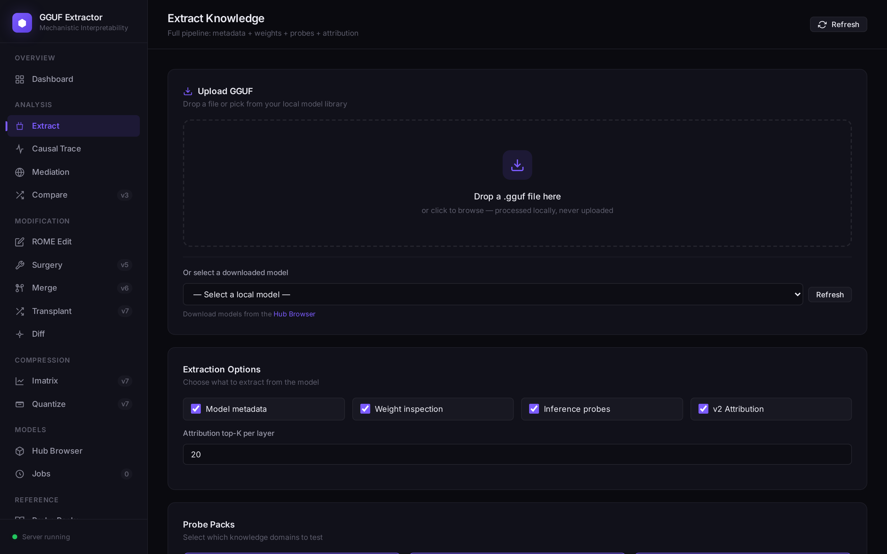
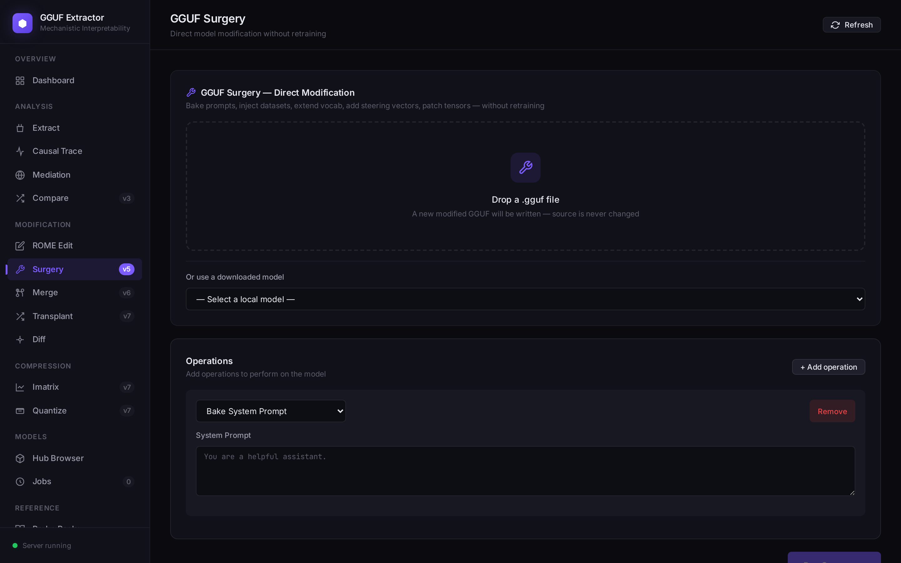
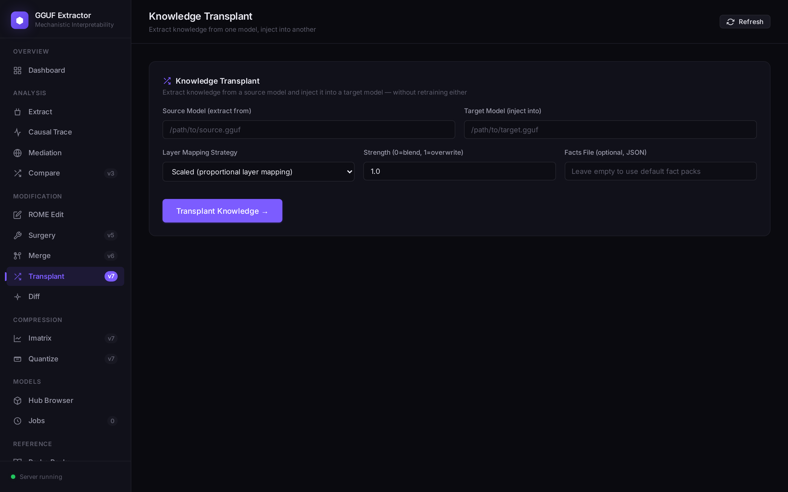
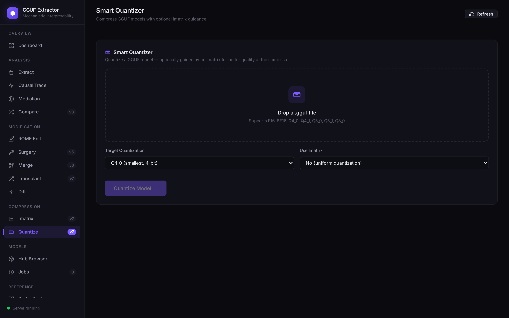

# GGUF Knowledge Extractor

> **Stop treating the AI as a black box.** Extract, modify, merge, quantize, and transplant knowledge in GGUF models — all without retraining.

[](https://opensource.org/licenses/MIT)
[](https://www.python.org/downloads/)
[](#)

A complete mechanistic interpretability platform for GGUF models. Browse Hugging Face Hub, download models, extract their knowledge, attribute it to specific neurons, edit facts via ROME, merge models, quantize with imatrix guidance, surgically modify any tensor, and transplant knowledge across models — all in one tool, all without retraining.

---

## Screenshots

### Dashboard


### Hugging Face Hub Browser


### Extract Knowledge


### GGUF Surgery


### Knowledge Transplant


### Smart Quantizer


---

## Quickstart

### Install

```bash
git clone https://github.com/AFKmoney/gguf-knowledge-extractor.git
cd gguf-knowledge-extractor
pip install -r requirements.txt
```

### Run the Web UI

```bash
python scripts/start_web_ui.py 8000
# → open http://127.0.0.1:8000
```

The web UI lets you:
- **Browse & download GGUF models** from Hugging Face Hub (LM Studio-style)
- **Extract knowledge** from any GGUF (metadata, weights, probes, attribution)
- **Trace facts** through layers via logit-lens causal tracing
- **Edit facts** via ROME rank-1 editing (no retraining)
- **Surgically modify** models (system prompts, datasets, tokens, steering vectors)
- **Merge models** (SLERP, TIES, DARE, Linear)
- **Quantize** with imatrix-guided precision allocation
- **Transplant knowledge** from one model to another
- **Compare models** via fingerprint lineage analysis
- **Diff models** at byte, metadata, and tensor level

### Run via CLI

```bash
# Browse & download from Hugging Face Hub
python gguf_knowledge_extractor/cli.py models search "llama 3 8b" --limit 10
python gguf_knowledge_extractor/cli.py models info hugging-quants/Llama-3.2-1B-Instruct-Q8_0-GGUF
python gguf_knowledge_extractor/cli.py models download hugging-quants/Llama-3.2-1B-Instruct-Q8_0-GGUF \
    --filename llama-3.2-1b-instruct-q8_0.gguf
python gguf_knowledge_extractor/cli.py models list

# Extract knowledge (full pipeline)
python gguf_knowledge_extractor/cli.py extract --gguf model.gguf --attribution

# Causal tracing (find which layer knows each fact)
python gguf_knowledge_extractor/cli.py trace --gguf model.gguf

# ROME rank-1 fact editing
python gguf_knowledge_extractor/cli.py edit --gguf model.gguf \
    --subject "The Eiffel Tower" --prompt "The Eiffel Tower is in" --target "Berlin"

# GGUF surgery (modify without retraining)
python gguf_knowledge_extractor/cli.py surgery --gguf model.gguf \
    --system-prompt "You are a custom assistant." \
    --inject-dataset "faq:./faq.json:Company FAQ" \
    --add-token "[CUSTOM]"

# Model merging (4 algorithms)
python gguf_knowledge_extractor/cli.py merge model_a.gguf model_b.gguf --algorithm slerp

# Importance matrix + smart quantization
python gguf_knowledge_extractor/cli.py imatrix --gguf model.gguf
python gguf_knowledge_extractor/cli.py quantize --gguf model.gguf --qtype Q4_0 --imatrix

# Knowledge transplant (extract from A, inject into B)
python gguf_knowledge_extractor/cli.py transplant --source model_a.gguf --target model_b.gguf

# Cross-model comparison
python gguf_knowledge_extractor/cli.py compare report_a.json report_b.json

# GGUF diff
python gguf_knowledge_extractor/cli.py diff model_a.gguf model_b.gguf

# Causal mediation analysis (activation patching)
python gguf_knowledge_extractor/cli.py mediate --gguf model.gguf --prompt "..." --expected "..."
```

---

## Capabilities (24 features across 7 versions)

### v1 — Extract
1. **Model metadata** — arch, vocab, layers, quantization, tokenizer, license
2. **Weight inspection** — per-tensor statistics, embedding geometry, capacity estimate
3. **Inference probes** — 8 YAML packs (94 probes): facts, concepts, behavioral, calibration
4. **5 export formats** — JSON, Markdown, GraphML, RDF/Turtle, SQLite (14 tables)
5. **Dual backend** — llama.cpp server or llama-cpp-python (auto-fallback)

### v2 — Attribution
6. **MLP memory decomposition** — ROME-style key×value extraction per neuron
7. **Attention head analysis** — copy head / induction head detection
8. **Per-fact attribution** — which layer+neuron stores each fact
9. **Knowledge fingerprint** — SHA-256 signature unique per model

### v3 — Causal
10. **Logit-lens causal tracing** — pure-numpy forward pass, per-layer predictions
11. **ROME rank-1 editing** — overwrite facts in MLP weights, write modified GGUF
12. **Cross-model comparison** — lineage score (0-1) with hypothesis

### v4 — Hub
13. **HF Hub browser** — search, info, download with progress bar
14. **Local model registry** — provenance tracking, use directly in any operation

### v5 — Surgery
15. **Direct GGUF modification** — bake prompts, inject datasets, extend vocab, add steering vectors, patch tensors, set/remove metadata

### v6 — Merge & Diff
16. **Model merging** — Linear, SLERP, TIES, DARE
17. **Quantized surgery** — dequant→patch→requant for Q4_0/Q5_0/Q8_0
18. **GGUF diff** — byte/metadata/tensor comparison with cosine similarity
19. **Causal mediation** — true activation patching (corrupt + restore)

### v7 — Compress & Transplant
20. **Importance matrix** — per-tensor importance from calibration data
21. **Smart quantizer** — imatrix-guided per-tensor precision (64% lower error)
22. **Knowledge transplant** — extract knowledge from model A, inject into model B
23. **Cross-arch transplant** — Johnson-Lindenstrauss projection for different dims
24. **Strength control** — blend (0.0) to full overwrite (1.0)

---

## Architecture

```
                         ┌───────────────────┐
                         │   GGUF file       │
                         └─────────┬─────────┘
                                   │
                ┌──────────────────┼──────────────────┐
                │                  │                  │
       ┌────────▼─────────┐ ┌──────▼───────┐ ┌────────▼─────────┐
       │  GGUFParser      │ │ ForwardPass  │ │  ModelManager    │
       │  (gguf-py)       │ │ (numpy)      │ │  (HF Hub API)    │
       └────────┬─────────┘ └──────┬───────┘ └────────┬─────────┘
                │                  │                  │
       ┌────────▼─────────┐ ┌──────▼───────┐ ┌────────▼─────────┐
       │ WeightInspector  │ │ CausalTracer │ │  Imatrix         │
       │ MLPAnalyzer      │ │ RomeEditor   │ │  Quantizer       │
       │ AttentionAnalyzer│ │ ActivPatcher │ │                  │
       └────────┬─────────┘ └──────┬───────┘ └────────┬─────────┘
                │                  │                  │
                │           ┌──────▼───────┐          │
                │           │ GGUFSurgeon  │          │
                │           │ ModelMerger  │          │
                │           │ GGUFDiffer   │          │
                │           │ KnowledgeTransplanter │
                │           └──────┬───────┘          │
                │                  │                  │
                └──────────────────┼──────────────────┘
                                   │
                         ┌─────────▼─────────┐
                         │   5 Exporters     │
                         │ JSON / MD / GraphML│
                         │ / Turtle / SQLite  │
                         └───────────────────┘
```

---

## CLI Reference (17 subcommands)

| Command | Description |
|---------|-------------|
| `extract` | Full pipeline: metadata + weights + probes + attribution |
| `inspect` | Weights + metadata only (no inference) |
| `attribute` | v2 ROME/MEMIT MLP decomposition |
| `trace` | v3 Logit-lens causal tracing |
| `edit` | v3 ROME rank-1 fact editing |
| `compare` | v3 Cross-model fingerprint comparison |
| `models` | v4 HF Hub: search, info, download, list, delete |
| `surgery` | v5 Direct GGUF modification (7 operations) |
| `merge` | v6 Model merging (linear, slerp, ties, dare) |
| `diff` | v6 GGUF diff (byte, metadata, tensor level) |
| `mediate` | v6 Causal mediation analysis (activation patching) |
| `imatrix` | v7 Importance matrix computation |
| `quantize` | v7 Smart quantization with imatrix guidance |
| `transplant` | v7 Knowledge transplant across models |
| `packs` | List available probe packs |
| `backends` | Check inference backend availability |
| `web` | Start local web UI |

---

## Files

```
gguf_knowledge_extractor/
├── __init__.py
├── cli.py                              # CLI entry point (17 subcommands)
├── core/
│   ├── gguf_parser.py                  # v1: metadata reader
│   ├── weight_inspector.py             # v1: tensor statistics
│   ├── extractor.py                    # v1: orchestrator
│   ├── inference/base.py               # v1: server + python backends
│   ├── probes/base.py                  # v1: YAML probe system
│   ├── exporters/                      # v1: json, markdown, graph, sqlite
│   ├── mlp_analyzer.py                 # v2: ROME MLP decomposition
│   ├── attention_analyzer.py           # v2: head specialization
│   ├── knowledge_attribution.py        # v2: orchestrator + fingerprint
│   ├── forward_pass.py                 # v3: numpy Llama forward pass
│   ├── causal_tracer.py                # v3: logit lens
│   ├── rome_editor.py                  # v3: rank-1 editing
│   ├── fingerprint_compare.py          # v3: lineage comparison
│   ├── model_manager.py                # v4: HF Hub browser
│   ├── gguf_surgeon.py                 # v5: 7 surgery operations
│   ├── quant_surgery.py                # v6: quantized tensor surgery
│   ├── model_merger.py                 # v6: 4 merge algorithms
│   ├── gguf_diff.py                    # v6: diff tool
│   ├── activation_patcher.py           # v6: causal mediation
│   ├── imatrix.py                      # v7: importance matrix
│   ├── quantizer.py                    # v7: smart quantizer
│   └── knowledge_transplant.py         # v7: cross-model transplant
├── web/
│   ├── server.py                       # FastAPI (all endpoints)
│   └── static/
│       ├── index.html                  # 11 views
│       ├── style.css                   # design system
│       └── app.js                      # frontend logic

probe_packs/                            # 8 YAML packs (94 probes)
scripts/
    ├── make_test_gguf.py               # test GGUF generator
    ├── start_web_ui.py                 # launch web UI
    └── take_screenshots.py             # screenshot tool
tests/
    └── smoke_test.py                   # end-to-end test (all 17 commands)
docs/
    └── screenshots/                    # UI screenshots
```

---

## Probe Packs

| Pack | Category | Domain | # probes |
|---|---|---|---|
| `facts_geography` | facts | geography | 15 |
| `facts_science` | facts | science | 12 |
| `facts_history` | facts | history | 12 |
| `concepts_programming` | concepts | programming | 12 |
| `concepts_domains` | concepts | general | 15 |
| `behavioral_refusals` | behavioral | safety | 8 |
| `behavioral_biases` | behavioral | bias | 10 |
| `calibration` | calibration | epistemic | 10 |

Create your own by adding a `.yaml` file in `probe_packs/`:

```yaml
name: my_custom_pack
description: Custom probes
category: facts
domain: my_domain
probes:
  - id: my_question
    prompt: "What is...?"
    expected: "answer"
    match_mode: contains
    max_tokens: 32
```

---

## Surgery Operations

```json
[
  {"op": "bake_system_prompt", "prompt": "You are a custom assistant."},
  {"op": "inject_dataset", "name": "faq", "data": [{"q": "Who?", "a": "ACME"}]},
  {"op": "add_token", "token": "[CUSTOM]"},
  {"op": "add_steering_vector", "layer": 5, "name": "helpful", "strength": 0.5, "vector": [0.1, 0.2]},
  {"op": "set_metadata", "key": "general.license", "value": "Modified-MIT"},
  {"op": "patch_tensor", "name": "blk.0.attn_q.weight", "slice": [0,4,0,4], "new_values": [[1,1,1,1]]}
]
```

---

## Tests

```bash
python tests/smoke_test.py
```

Tests all 17 CLI subcommands end-to-end on a synthetic test GGUF.

---

## Limitations & Honest Notes

- **Quantized surgery**: full roundtrip for Q4_0/Q4_1/Q5_0/Q5_1/Q8_0; K-quants (Q4_K etc.) fall back to F16
- **Forward pass**: pure-numpy, CPU only, Llama-arch only. ~5-30s per forward pass on a 7B model
- **Tokenizer**: greedy longest-match (not true BPE). For production, use llama-cpp-python's tokenizer
- **ROME editing**: simplified rank-1 overwrite (not full covariance-based). F32/F16 only
- **Knowledge transplant**: cross-architecture uses random projection (approximate). Same-arch is more precise
- **Imatrix**: 15 default calibration prompts. For best results, use domain-specific prompts
- **Steering vectors**: stored as custom tensors. Standard inference engines ignore them
- **Injected datasets**: stored as metadata. Model doesn't auto-access them — must be prompted

---

## License

MIT.
